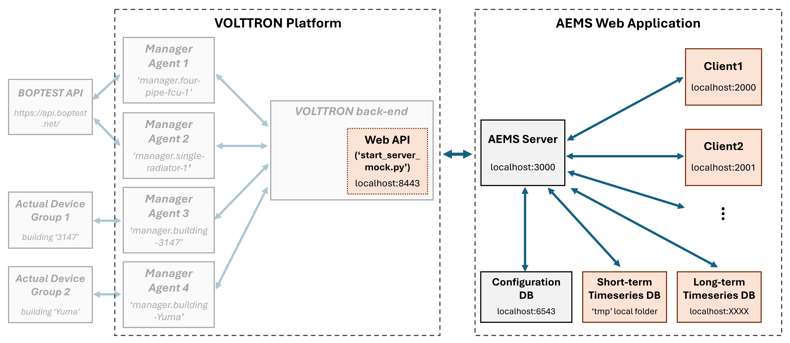
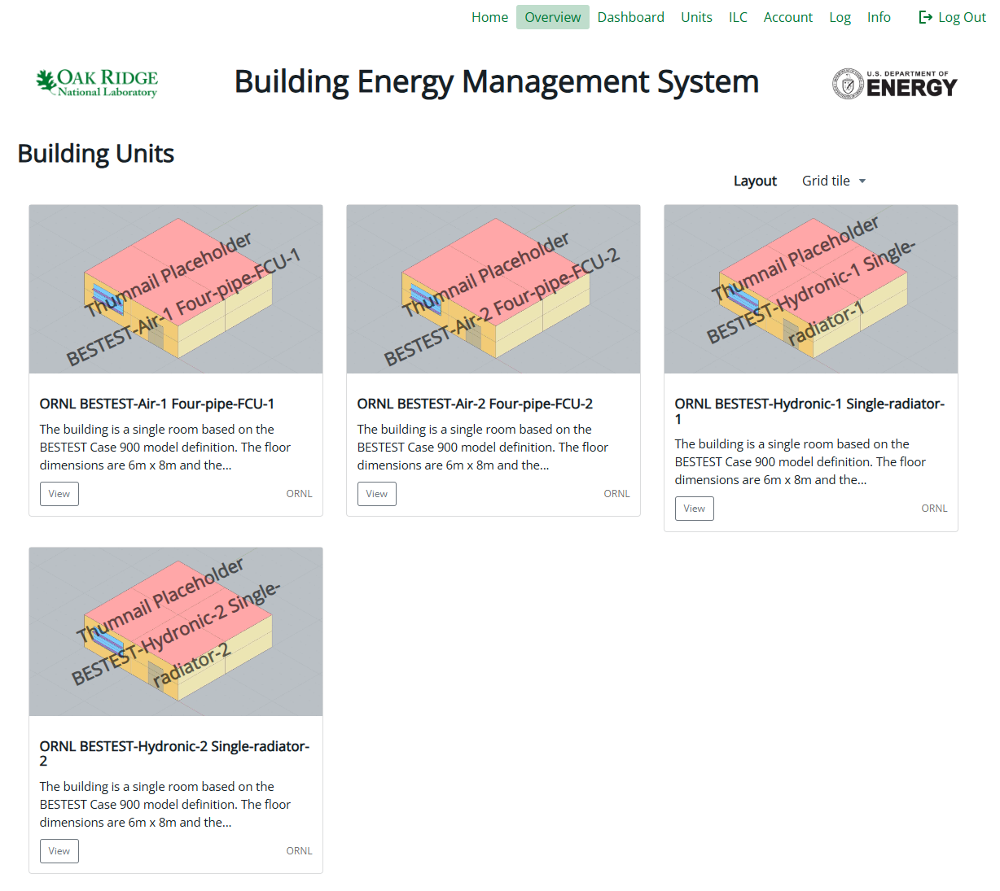
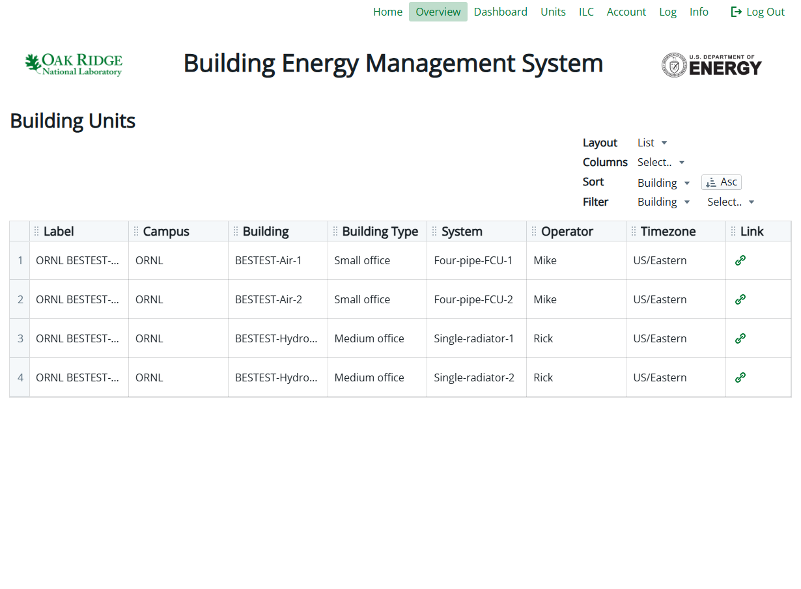
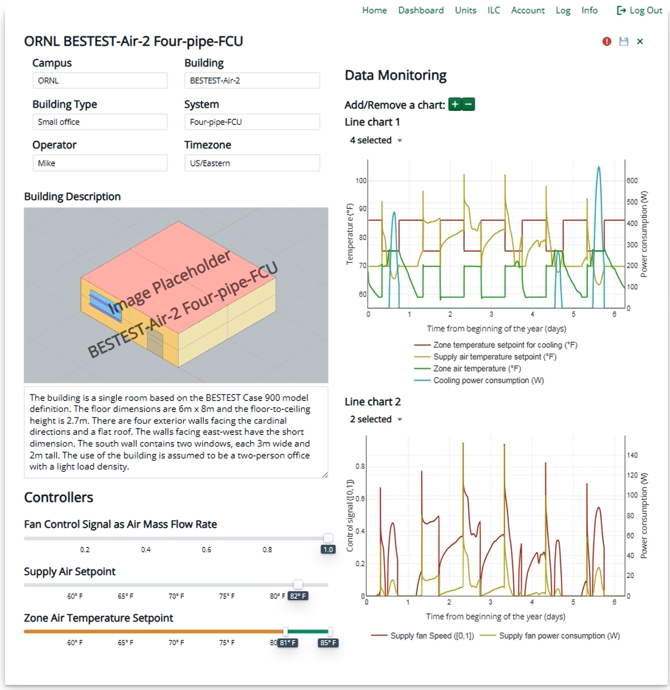

# Web-UI Development

## Overview
This project aims to develop a generalizable web UI for building energy management system, built on top of PNNL's AEMS platform. While AEMS provides a comprehensive system environment from actuators to web applications, this project primarily contributes to:
1. Sensor data analysis and integration with advanced control algorithms
2. User-friendly and interactive front-end web interface
3. Extensive configuration environment for building systems and sensors

The diagram below illustrates the overall system architecture and highlights the scope of this work. Red-colored components denote the main development areas, while grey-colored components represent minor enhancements made to ensure system compatibility.
**System Components**:
1. **Client**: Provides an interactive web interface with control functionality and sends control inputs to the server via API.
2. **Server**: Serves as a middleware facilitating communication between client web applications and the VOLTTRON backend.
3. **Configuration DB**: Stores static information, including building configurations, user credentials, and data logs.
4. **Short-term timeseries DB**: Temporarily stores recent sensor/actuator data (e.g., 30 data points) from VOLTTRON to prevent data loss in case of disconnections or system reboots.
5. **Long-term timeseries DB (TBD)**: A separate persistent database for storing all historical sensor/actuator data. It supports analytics and data visualization (e.g., via Grafana).
6. **Web API wtihin VOLTTRON back-end**: Interfaces the AEMS server with VOLTTRON backend through JSON-RPC. [Detailed documentation](https://github.com/JChung-Research/volttron-pnnl-aems/tree/web-ui-development/aems-edge/Manager/server).


<div style="text-align: center;">
  
</div>


## Key contributions
1. **Sensor Data Integration**: Enables AEMS to collect real-time sensor data from VOLTTRON, store it in a short-term DB, and relay it to the client application.

2. **Building Unit Overview**: Displays available building units in both grid and list views on the `Overview` page for intuitive system navigation and interaction.

<div style="display: flex; justify-content: center; align-items: flex-start;">
  
  
</div>

3. **Sensor Data Visualization**: Allows users to visualize time-series data using dynamic line charts. Users can add or remove charts and select variables for display.

<div style="text-align: center;">
  
</div>

4. **Expanded building metadata and variables**: Expands configuration support for broader building system compatibility. Below is a list of the newly-supported building and control variables:

- bldgType: Type of building
- operator: Building operator
- image: Unit image
- description: Unit description
- supplyDuctPressure: Supply duct pressure setpoint for AHU
- coolingCoilValve: Cooling coil valve control signal for AHU
- heatingCoilValve: Heating coil valve control signal for AHU
- coolingCoilPump: Cooling coil pump control signal for AHU
- heatingCoilPump: Heating coil pump control signal for AHU
- supplyFanSpeed: Supply fan speed setpoint for AHU
- supplyAirSetpoint: Supply air temperature setpoint
- supplyHeaterSetpoint:  Supply temperature setpoint of the heater
- outsideAirDamperPosition: Outside air damper position setpoint for AHU
- returnAirDamperPosition: Return air damper position setpoint for AHU
- zoneDamperPosition: Damper position setpoint for a zone
- zoneReheatControl: Reheat control signal for a zone
- zoneAirCoolingSetpoint: Zone air temperature cooling setpoint
- zoneAirHeatingSetpoint: Zone air temperature heating setpoint
- zoneOperativeCoolingSetpoint: Zone operative temperature setpoint for cooling
- zoneOperativeHeatingSetpoint: Zone operative temperature setpoint for heating
- controlStagePump: Integer signal to control the stage of the pump either on or off
- hvacMode: Operating mode selection for HVAC systems, specifying 'auto', 'cooling', or 'heating' to control overall system behavior


## Quick Guide: Server Installation 
The server can run in a Docker container labeled app, which is automatically built and launched via Docker Compose. For detailed instructions, refer to the [docker-compose configuration](https://github.com/JChung-Research/volttron-pnnl-aems/tree/web-ui-development/aems-app#docker-compose).

#### Command
Build Docker images:
```bash
docker compose build
```

Create and start containers:
```bash
docker compose up -d
```

Start containers:
```bash
docker compose start
```

Stop containers:
```bash
docker compose stop
```

## Quick Guide: Client Installation
Follow the same steps described in the original project documentation. For detailed instructions, refer to the [client installation guide](https://github.com/JChung-Research/volttron-pnnl-aems/tree/web-ui-development/aems-app/client#installation). Below are summarized commands:

Install dependencies:
```bash
yarn install
```

Build the application:
```bash
yarn build
```

Start the development client:
```bash
yarn start
```
Press `CTRL+C` to stop the server.


## Prerequisites
Before launching the web server, ensure that the Python ManagerAgent is running to enable sensor collection from VOLTTRON backend. For detailed instructions, refer to the [ManagerAgent Setup Instructions](https://github.com/JChung-Research/volttron-pnnl-aems/tree/web-ui-development/aems-edge/Manager/server).

Additionally, open the server on `http://localhost:3000/` and clients on `http://localhost:2000/` to login using the credentials.

Default credentials:
```bash
Username: test-admin@aems.com
Password: ChAnGe_ThIs_PaSsWoRd_0x2E
```
