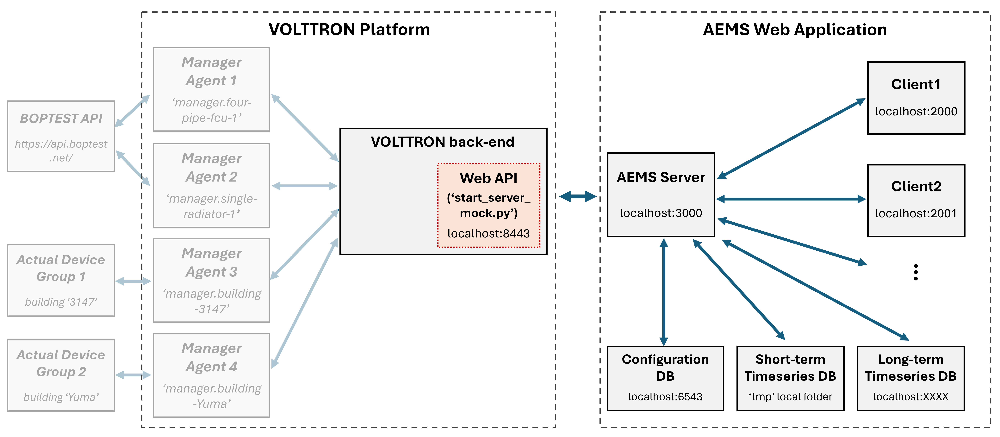

# Python Mock Server

## Overview
The **Python Mock Server** serves as a reference implementation for developers building or testing VOLTTRON web APIs. It demonstrates how a simulated VOLTTRON web API can interface with AEMS web applications by forwarding either:
1. Real-time sensor/actuator data from VOLTTRON agents, or
2. Emulated data from the BOPTEST API

to the AEMS server and client components through secure JSON-RPC communication. 
The mock server simulates this interaction without requiring a live VOLTTRON or 
BOPTEST environment, making it ideal for development and early-stage integration testing.

The diagram below illustrates the schematic system architecture, depicting the interaction between components and the role of the mock server in this workflow. The `start_server_mock.py` file emulates the behavior of VOLTTRON Manager Agents and transmits structured payloads to the AEMS server via API.




## Installation
To run the `start_server_mock.py` component, please follow the same steps outlined in the [AEMS Edge Install Usign Poetry](https://github.com/JChung-Research/volttron-pnnl-aems/tree/main/aems-edge/Manager).

## Prerequisites
Before starting the server, ensure that a valid SSL certificate and private key are installed. This is required to enable HTTPS and avoid any technical issues from insecure communication between the server and client.

## Run the virutal server
Once the installation is complete, you can start the mock server using the following command:
```bash
poetry run start-server-mock --certfile [path-to-certfile] --keyfile [path-to-keyfile]
```
Replace [path-to-certfile] and [path-to-keyfile] with the actual paths to your SSL certificate and key files.

## API Testing and Examples
To test API interactions with the server (e.g., authentication and JSON-RPC requests), refer to the detailed annotations provided in the `start_server_mock.py` file. This includes example request formats, supported methods, and expected payload structures.
