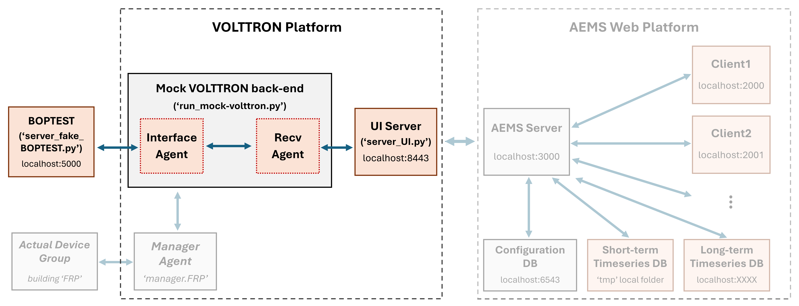

# Mock VOLTTRON Testing Kit

## Overview
The **Mock VOLTTRON Testing Kit** provides a lightweight development and testing environment to support the AEMS web application that analyzes and visualizes real-time sensor/actuator data. This kit eliminates the need to install the full VOLTTRON platform on a Linux OS or connect to physical BACnet devices. Instead, it mimics VOLTTRON’s architecture to simulate devices and data flows in a controlled, testable environment. 

It provides a mocked VOLTTRON environment that demonstrates how simulated agents can interface with the AEMS web application by forwarding/receiving either:
1. Emulated data from the BOPTEST API,
2. Control inputs from the AEMS server and clients, or
3. Real-time sensor/actuator data from simplified VOLTTRON Manager Agents (TBD)

using secure JSON-RPC communication. It simulates these interactions without requiring a live VOLTTRON instance or actual field devices, making it ideal for rapid development, debugging, and early-stage integration testing.

The diagram below illustrates the overall system architecture and highlights the scope of this kit. For details on the the AEMS web application, refer to the following [Web UI documentation](https://github.com/JChung-Research/volttron-pnnl-aems/blob/web-ui-development/aems-app/README_Web-UI.md).

**Main Components**
1. **Mock VOLTTRON**: Simulates core VOLTTRON agents' behavior including topic-based message publish/subscrib messaging and callback execution.
- **Interface Agent** (from [Sen's work](https://github.com/SenHuang19/volttron-pnnl-aems)): Periodically polls a mock backend API (e.g., BOPTEST), packages structured sensor data and metadata, and publishes messages to a specified VOLTTRON topic.  
- **Recv Agent** (from [Sen's work](https://github.com/SenHuang19/volttron-pnnl-aems)): Subscribes to VOLTTRON topics, captures published messages, invokes a dynamic callback function, and re-publishes to the next stage (e.g., UI server).
2. **UI Server**: Interfaces the AEMS server wtih VOLTTRON backend through JSON-RPC. [Detailed documentation](https://github.com/JChung-Research/volttron-pnnl-aems/tree/web-ui-development/aems-edge/Manager/server).
3. **Mock BOPTEST Server** (from [Sen's work](https://github.com/SenHuang19/volttron-pnnl-aems)): Simulates behavior or BOPTEST server by providing building control and environmental data.




## Installation
To set up the `mock-volttron` components,  clone the `mock-volttron` repository from GitHub to your local machine. Use the following commands in your terminal:

   ```bash
   git clone --branch web-ui-development https://github.com/JChung-Research/volttron-pnnl-aems.git
   cd volttron-pnnl-aems/mock-volttron
   ```


## Run the virutal servers
Once the installation is complete, you can each components with the following commands:

1. **Mock VOLTTRON**
```bash
python run_mock-volttron.py
```

2. **UI Server**
```bash
python test/server_UI.py --certfile [path-to-certfile] --keyfile [path-to-keyfile]
```
Replace [path-to-certfile] and [path-to-keyfile] with the actual paths to your SSL certificate and key files.

3. **BOPTEST Server**
```bash
python test/server_fake_BOPTEST.py
```

## Prerequisites
Before starting the UI server, ensure that a valid SSL certificate and private key are installed. This is required to enable HTTPS and avoid any technical issues from insecure communication between the UI server and AEMS server.
