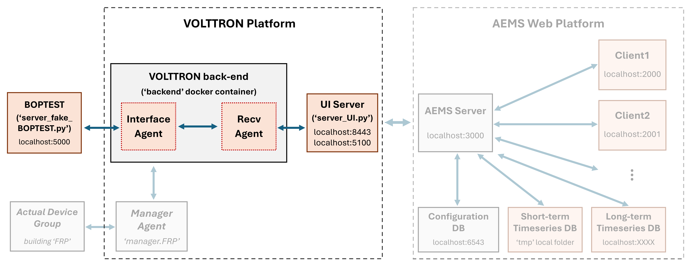

# VOLTTRON Testing Kit

**Note**: This work builds upon [Dr. Sen Huang's VOLTTRON folder](https://github.com/SenHuang19/volttron-pnnl-aems)

## Overview
The **VOLTTRON Testing Kit** provides a lightweight, self-contained development and testing environment for the AEMS web application, which analyzes and visualizes real-time sensor and actuator data. This kit eliminates the need to install the full VOLTTRON platform on a Linux OS or connect to physical BACnet devices. Instead, it simulates VOLTTRON driver agent behavior using emulated data flows through the BOPTEST API. 

The toolkit enables rapid development, debugging, and early-stage integration testing by simulating agent-based interactions through secure JSON-RPC communication. It supports:
1. Emulated data from the BOPTEST API,
2. Control inputs from the AEMS server and clients, or
3. Real-time sensor/actuator data from simplified VOLTTRON Manager Agents (TBD)

This environment demonstrates how simulated VOLTTRON agents interact with AEMS without requiring a full-scale deployment or physical hardware.

The diagram below illustrates the overall system architecture and highlights the scope of this kit. For details on the the AEMS web application, refer to the following [Web UI documentation](https://github.com/JChung-Research/volttron-pnnl-aems/blob/web-ui-development/aems-app/README_Web-UI.md).

**Main Components**
1. **Lightweight VOLTTRON Core**: Implements essential VOLTTRON agents including topic-based message publish/subscrib messaging and callback execution.
    - **Interface Agent**: Periodically polls a mock backend API (e.g., BOPTEST), packages structured sensor data and metadata, and publishes messages to a specified VOLTTRON topic.  
    - **Recv Agent**: Subscribes to VOLTTRON topics, captures published messages, invokes a dynamic callback function, and re-publishes to the next stage (e.g., UI server).
2. **UI Server**: Interfaces the AEMS server wtih VOLTTRON backend through JSON-RPC. [Detailed documentation](https://github.com/JChung-Research/volttron-pnnl-aems/tree/web-ui-development/aems-edge/Manager/server).
3. **Mock BOPTEST Server**: Simulates behavior or BOPTEST server by providing building control and environmental data. Will integrate actual BOPTEST API for more interactive emulation. 



## Installation
To set up the `volttron` components,  clone the `volttron` repository from GitHub to your local machine. Use the following commands in your terminal:

```bash
git clone --branch web-ui-development https://github.com/JChung-Research/volttron-pnnl-aems.git
cd volttron-pnnl-aems/volttron
```

Once the download is complete, build and launch the VOLTTRON Docker container:

```bash
docker-compose build --no-cache
docker-compose up
```

## Run the virutal servers
Once the Docker container is running, you can start the other components with the following commands:

1. **UI Server**
```bash
python test/server_UI.py --certfile [path-to-certfile] --keyfile [path-to-keyfile]
```
Replace [path-to-certfile] and [path-to-keyfile] with the actual paths to your SSL certificate and key files.

2. **BOPTEST Server**
```bash
python test/server_fake_BOPTEST.py
```

## Prerequisites
Before starting the UI server, ensure that a valid SSL certificate and private key are installed. This is required to enable HTTPS and avoid any technical issues from insecure communication between the UI server and AEMS server.

